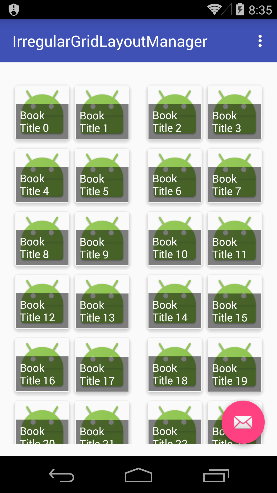
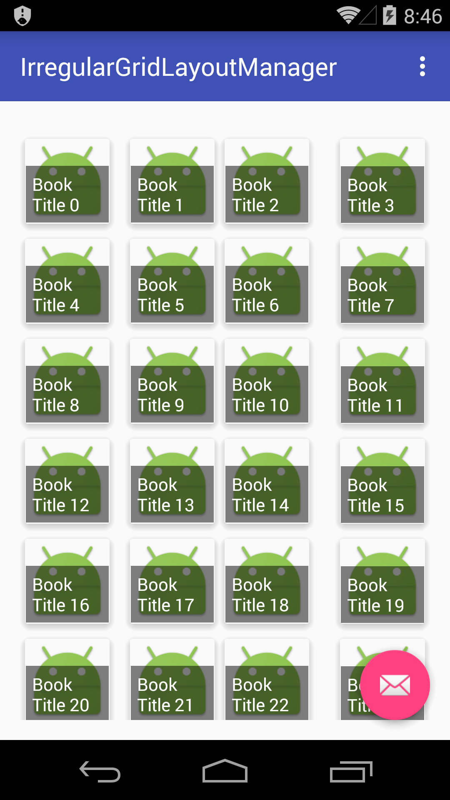
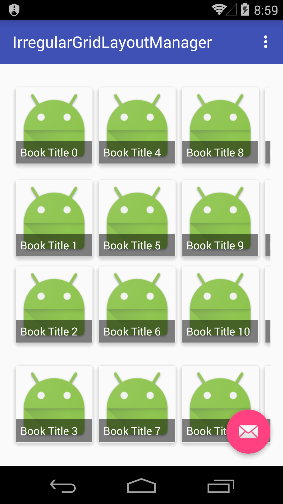

#IrregularGridLayoutManager

A Irregular GridLayoutManager.You can custom divider for each span.It can work on vertical or horizontal.

这是一个不规则的GridLayoutManager,你可以自定义每个跨度(span)的间距(divider).它可能适用于水平方向和垂直方向上.






Reference(参考): 

[devunwired/recyclerview-playground](https://github.com/devunwired/recyclerview-playground)

[Building a RecyclerView LayoutManager](http://wiresareobsolete.com/2014/09/building-a-recyclerview-layoutmanager-part-1/)

#Useage

What you should do is add **`layoutManager.setSpanDividers(0, 50, 0);`** in you java file.

###Step1.

Copy IrregularGridLayoutManager.java to you project(keep package).

###Step2.

```java

    IrregularGridLayoutManager layoutManager = new IrregularGridLayoutManager(this, 4);
    layoutManager.setSpanDividers(0, 50, 0); //set you custom dividers.
    mRecyclerView.setLayoutManager(layoutManager);

```

#License

This project is licensed under the MIT License.Please refer the License.txt file. Just use it. LOL.
